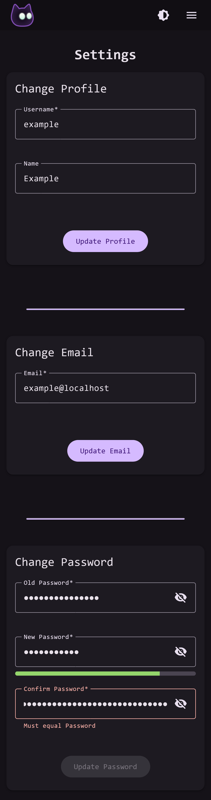

# VoidAuthn

<p align="center">
  
</p>

VoidAuthn is an OIDC Provider, Proxy Auth, and User Management application designed to make securing your selfhosted applications easy.

## Features:

* OIDC Provider
* Proxy ForwardAuth Endpoint
* User Management
* Invitations
* Email Support
* Custom Branding and CSS
* ZXCVBN Password Complexity Rules

VoidAuthn is accessed through an easy to use web interface, meant to make user sign-in and domain management simple. The web app also has a configurable app title, logo, and theme color so you can make your sign-in page match your brand.

## Screenshots
<p align="center">
Login Portal
</P>
<p align="center">
  
</p>
<p align="center">
Profile Settings
</P>
<p align="center">
  
</p>

## Getting Started

VoidAuthn **MUST** be behind an https terminating reverse-proxy. VoidAuthn does **NOT** provide https termination itself, but it is absolutely **required**. A simple setup using docker compose might look like this:

```
services:
  # ---------------------------------
  # Your reverse-proxy service here
  # ---------------------------------

  voidauthn: 
    image: notquitenothing/voidauthn:latest
    volumes:
      - config:/app/config
    environment:
      # Required environment variables
      APP_DOMAIN: # required
      DB_PASSWORD: # required
      DB_HOST: # required
      STORAGE_KEY: # required
    depends_on:
      - voidauthn-db

  voidauthn-db:
    image: postgres:17
    environment:
      POSTGRES_PASSWORD: # required
    volumes:
      - db:/var/lib/postgresql/data

volumes:
  config:
  db:
```

## Roadmap

* ProxyAuth Domain Rules
* Passkey Support

## Disclaimer

I am not a security researcher, just a developer unsatisfied with the complexity and difficult onboarding process of existing selfhosted auth solutions. Use at your own risk.

## Credits

node-oidc-provider

authelia

lldap
