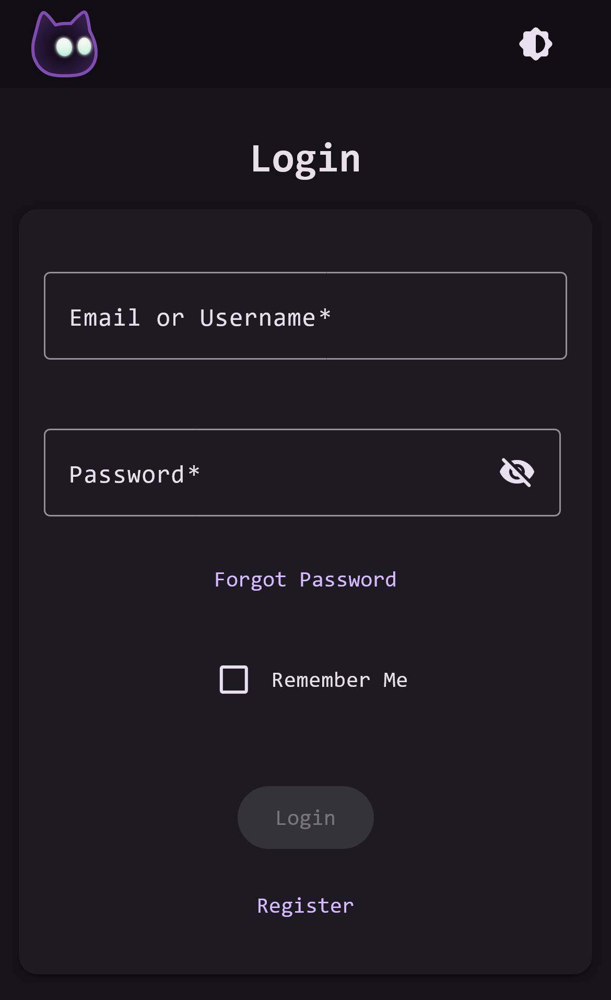
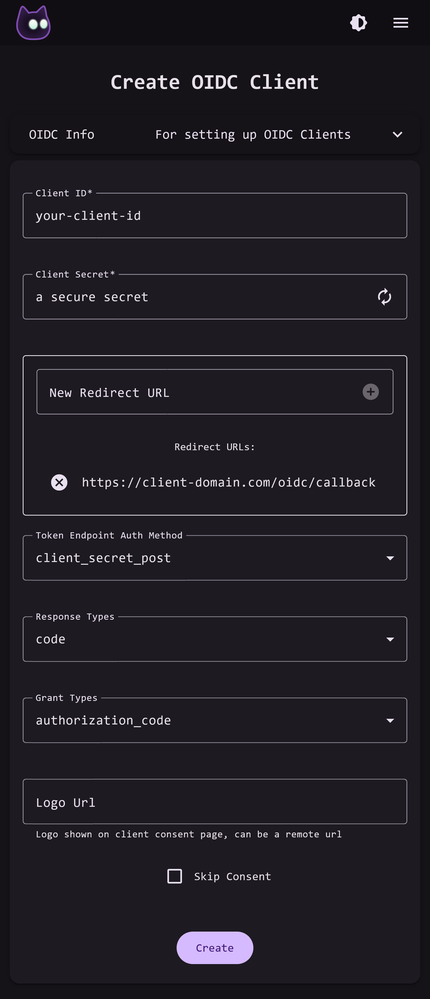

# VoidAuth

<p align="center">
  
</p>

VoidAuth is a Single Sign-On Provider that includes: User Management, Proxy Auth, and is an OIDC Provider. It is designed to make securing your applications and resources easy.

<p align="center">
Login Portal
</P>
<p align="center">
  
</p>

## Features

* User Management
* OIDC Provider
* Proxy ForwardAuth Domains
* Invitations
* Password Reset with Email Address Verification
* Custom Branding and CSS
* ZXCVBN Password Complexity Rules

VoidAuth is accessed through an easy to use web interface, meant to make user sign-in and domain management simple. The web app also has a configurable app title, logo, and theme color so you can make your sign-in page match your brand.

## Getting Started

> [!IMPORTANT]
> During the first start of the app, the **initial admin username and password** will be shown in the logs. They will never be shown again.

> [!IMPORTANT]
> Any user in the **auth_admins** group will be an administrator in VoidAuth.

> [!WARNING]  
> VoidAuth **MUST** be behind an https terminating reverse-proxy. VoidAuth does **NOT** provide https termination itself, but it is absolutely **required**. A simple setup using docker compose might look like this:

```yaml

services:
  # ---------------------------------
  # Your reverse-proxy service here
  # ---------------------------------

  voidauth: 
    image: voidauth/voidauth:latest
    volumes:
      - config:/app/config
    environment:
      # Required environment variables
      APP_DOMAIN: # required
      DB_PASSWORD: # required
      DB_HOST: voidauth-db # required
      STORAGE_KEY: # required
    depends_on:
      - voidauth-db

  voidauth-db:
    image: postgres:17
    environment:
      POSTGRES_PASSWORD: # required
    volumes:
      - db:/var/lib/postgresql/data

volumes:
  config:
  db:
```

## Customization

VoidAuth is configurable primarily by environment variable. The available environment variables and their defaults are listed in the table below:

| Name                     | Default  | Description                                                                                                                                                                    | Required |
| :------------------------- | ---------- | :------------------------------------------------------------------------------------------------------------------------------------------------------------------------------- | :--------- |
| APP_DOMAIN               |          | Domain and path app will be served on. Must include`http(s)://`. ex. `https://your.domain.here/optional/subpath`                                                               | ✅       |
| APP_TITLE                | VoidAuth | Title that will show on the web interface.                                                                                                                                     |          |
| APP_PORT                 | 3000     | The port that app will listen on.                                                                                                                                              |          |
| APP_COLOR                | #8864c4  | Theme color, rgb format; ex. #xxyyzz                                                                                                                                           |          |
| SIGNUP                   | false    | Whether the app allows new users to register themselves without invitation.                                                                                                    |          |
| SIGNUP_REQUIRES_APPROVAL | true     | Whether new users who register themselves require approval by an admin.                                                                                                        |          |
| EMAIL_VERIFICATION       | false    | If true, users who set or change their email address will get a verification email before it can be used. If you are not using an email provider, this should be set to false. |          |
| DB_HOST                  |          | Host address of the database.                                                                                                                                                  | ✅       |
| DB_PASSWORD              |          | Password of the database.                                                                                                                                                      | ✅       |
| DB_PORT                  | 5432     | Port of the database.                                                                                                                                                          |          |
| DB_USER                  | postgres | Username used to sign into the database by the app.                                                                                                                            |          |
| DB_NAME                  | postgres | Database name used to connect to the database by the app.                                                                                                                      |          |
| STORAGE_KEY              |          | Storage encryption key for secret values such as keys and client secrets. Must be at least 32 characters long and should be randomly generated.                                | ✅       |
| STORAGE_KEY_SECONDARY    |          | Secondary storage encryption key, used when rotating the primary storage encryption key.                                                                                       |          |
| PASSWORD_STRENGTH               | 2        | The minimum strength of users passwords, at least 3 is recommended. Must be between 0 - 4.                                                                                     |          |
| SMTP_HOST                |          | SMTP Host; ex. mail.example.com                                                                                                                                                |          |
| SMTP_FROM                |          | SMTP From field; ex.`My App<app@example.com>`                                                                                                                                  |          |
| SMTP_PORT                | 587      | SMTP port to use.                                                                                                                                                              |          |
| SMTP_SECURE              | false    | SMTP has TLS/SSL enabled.                                                                                                                                                      |          |
| SMTP_USER                |          | SMTP username used to sign into email provider; ex`user@example.com`                                                                                                           |          |
| SMTP_PASS                |          | SMTP password used to sign into email provider                                                                                                                                 |          |

Your own branding can be applied to the app by mounting the **/app/config** directory and adding or modifying the existing files.

The logo and favicon of the web interface can be customized by placing your own **logo.png** and **favicon.png** in the mounted **/app/config/branding** directory.

The email templates for email verification, invitations, and password resets can be changed by modifying the files in the **/app/config/email_templates** directory. The files are [pug](https://pugjs.org/api/getting-started.html) template format and text, which should be updated together when changed. To reset your changes to the email templates, just delete (or move) your **/app/config/email_templates** directory and it will be regenerated.

## Integration

### OIDC

When setting up OIDC Clients (Apps) you should follow the guide provided by the application. You will be able to set all the configuration values using the VoidAuth OIDC Clients admin page by creating a new OIDC Client. For example, a client app guide:

```
client_id: "your-client-name"
client_secret: "a secure secret"
redirect_url: "https://client-domain.com/oidc/callback"
token_endpoint_auth_method: "client_secret_post"
response_types: "code"
grant_types: "authorization_code"
```

Which would be followed by filling out the Create OIDC Client form like this:
<p align="center">
  
</p>

### ProxyAuth

VoidAuth exposes two proxy auth endpoints, which one you use will depend on your reverse-proxy.

| Endpoint                | Reverse Proxy |
| ------------------------| ------------- |
| /api/authz/forward-auth | [Caddy](https://caddyserver.com/docs/caddyfile/directives/forward_auth), [Traefik](https://doc.traefik.io/traefik/middlewares/http/forwardauth/)  |
| /api/authz/auth-request | [NGINX](https://nginx.org/en/docs/http/ngx_http_auth_request_module.html) |

You can set up ProxyAuth secured domains on the VoidAuth Admin ProxyAuth Domains page.

## Roadmap

| Item               | Status |
| -------------------| ------ |
| Passkey Support    |        |
| Integration Guides |        |

## Disclaimer

I am not a security researcher or expert, just a developer unsatisfied with the difficult onboarding process of existing selfhosted auth solutions. Use at your own risk.

## Credits

[node-oidc-provider](https://github.com/panva/node-oidc-provider) The core library of VoidAuth, handles OIDC Provider functionality

[Angular](https://angular.dev) Frontend web framework used by VoidAuth

[authelia](https://www.authelia.com/) An amazing project and heavy inspiration, VoidAuth aims to be less feature-complete but more user friendly

[lldap](https://github.com/lldap/lldap) Inspiration for user management, a very good selfhosted ldap service
